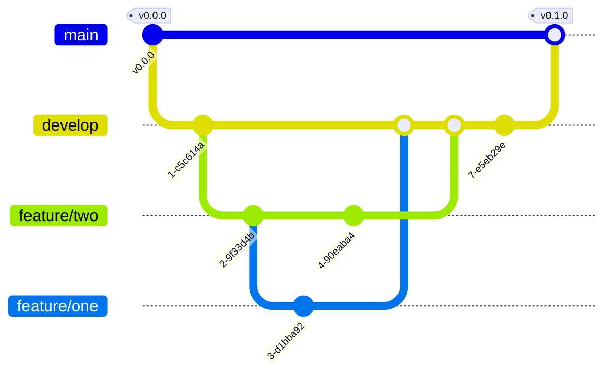

# Serial Communication - Part II

</br>

Here we are in a new practice about serial communications. From the previous practice, we **clearly understand what asynchronous serial communication is**, **what ASCII encoding is**, and **what sending data in _raw_ means and its benefits**.

> [!WARNING]
> What? How? You don't understand it clearly? 😱 Go back immediately to the previous practice to review it and do it again if necessary. Don't hesitate to **ask whatever is necessary to fully understand everything covered** so far about serial communication. Remember that this is a **very important topic in the field of microcontrollers** and that everything we'll see in this practice, and the next one, will build upon the concepts from the previous practice. **Make sure you have integrated all the concepts covered!**

A very important aspect we saw about serial communication is the **use of _term chars_ to indicate the end of a message or instruction**. In ASCII encoding, we use two _term chars_: the carriage return (`\r` or `0x0D` in _raw_) and the new line character (`\n` or `0x0A` in _raw_). This way, Arduino's serial terminal knew when an instruction or message ended to proceed to plot the data in Teleplot or display the instruction or message on a new line in the serial monitor.

In **_raw_** we saw that things got complicated. Which character do we set as _term char_? And more importantly: once we set the _term char_ (e.g., `0x00`), how do we ensure that this character/byte doesn't appear in the message body or instruction and is detected as a **false _term char_**? An example. Imagine we set the _term char_ as `0x00` and the message we want to send is `0xA1 0x12 0x01 0xFF 0x00 0x23 0x32 0xAF 0x05`. Adding the _term char_, the instruction/message would look like this:

---

0xA1 0x12 0x01 0xFF **0x00** 0x23 0x32 0xAF 0x05 **0x00**

---

How does the microcontroller or computer know that the instruction ends at the last `0x00` and not at the first one? (Consider that before and after this instruction would be bytes from other messages already sent and to be sent.) The solution is to **encode the message so that the character we've set as _term char_ doesn't appear in it**. In this case, prevent sending a `0x00`.

There are countless encoding protocols of this type, and we'll choose one or another based on, among other criteria, the **_overhead_** (or number of bytes added to perform the encoding). In this course, we'll use the **COBS protocol (_Consistent Overhead Byte Stuffing_) for its simplicity and low _overhead_**.

In the practice, we'll see directly how to implement COBS, but **I'll give you the recipe**. The complete explanation of **its implementation must be read directly from an article by its creators Stuart Cheshire and Mary Baker**. Our friend Stuart has posted his article on his personal website, so we have access to his _paper_ for free. **You can find it [here](http://www.stuartcheshire.org/papers/COBSforToN.pdf)**. I have also added the [file to the repository](/.github/files/COBSforToN.pdf) for preservation purposes, but access it from the original link if available. Reading **the _paper_ is part of the practice**. The authors have done a magnificent job articulating a writing that avoids technical flourishes, so although it's obviously an engineering _paper_ and there will be technicalities, **a person who is not a computer engineer can perfectly understand what is being discussed**.

> [!WARNING]
> **I'm going to repeat it. Ahem, ahem 😤 "In the guide I'll only put the recipe. In the _[paper](http://www.stuartcheshire.org/papers/COBSforToN.pdf)_, you have to read the algorithm explanation".**

How will we do our practice in pajamas from our homes? **Each team member will do different but related work**. **Member `A`** will create a **function to encode** a byte packet in COBS. **Member `B`** will create a **function to decode** a byte packet in COBS. I repeat, one handles encoding and the other decoding. Simple, right?

Well. To **verify that we have correctly implemented the (de)coding** in COBS, we'll implement a series of **unit tests**. **Unit tests are programs that call our functions and check their correct operation**. The usual way to implement them is to give the function to be tested a value and check what it returns. The value sent to the function being tested is called a **"test vector"**. Since we know the test vector as we set it at will, **we know what the function should return beforehand**. **By comparing that known value beforehand with what the function actually returns** to test, we can validate the correct operation of the function. This is what I have been doing since the beginning of the course in the automated tests you have been running.

Among countless options, there are **two philosophies** in implementing unit tests: 1) **oneself** implements the unit tests of their functions, or 2) **one team** is in charge of programming and **a second** team is only in charge of implementing the unit tests. Each philosophy has its advantages and disadvantages, which are outside the scope of the course. In this part of the practice, I give you the tests already made so you can see an example. You won't have to make them. **But look at them and make an effort to understand them well**.

We'll do everything in a very structured and guided way. So let's sit down, do the practice, and enjoy.

Let's go!

## Objectives

- (De)coding of byte packets in COBS.
- First contact with unit tests.
- Git conflict resolution. (Yes, there will be conflicts 😈)

## Procedure

Have you read the [_paper_](http://www.stuartcheshire.org/papers/COBSforToN.pdf) yet? Come on. Read it first.

> [!WARNING]
> Super important to understand the COBS encoding explained in the _paper_. If you do the practice directly without reading/understanding the _paper_, everything will sound like [Taushiro](https://en.wikipedia.org/wiki/Taushiro_language) to you 😵 You've been warned...

Now then. Let's first break down what will be the **folder/file structure** to follow, **what each team member** should do, what will be the **established nomenclature** for our functions, and what will be the **git workflow**.

> [!NOTE]
> As always, read your partner's tasks too to know what they do and not miss any aspect of the practice.

### Directory/File Structure

The directory structure is already made for you, along with the files to develop. The structure will be as follows:

```
arduino
└── workspace
    └── shared
        └── cobs
            ├── include
            │   └── cobs.h
            ├── platformio.ini
            ├── src
            │   ├── cobs.cpp
            │   ├── cobs_weak.cpp
            │   └── main.cpp
            └── test
                └── test_main.cpp
```

In the `cobs.h` file we will create the interface of our COBS module (the header), while in the `cobs.cpp` file we will implement the definition of our encoding and decoding functions. Both members will work on the same files, so when we merge them there will inevitably be conflicts. But they will be easy to resolve, don't worry.

On the other hand, we have `main.cpp`, which exists because it must exist, but it is empty and we will keep it that way since we are not going to build any project. What we will do (or what is already provided) is the `test_main.cpp` file, which is the file that actually runs on the microcontroller when we launch the test command in PlatformIO. I provide this file already done, and it contains all the tests to which your encoding and decoding functions will be subjected.

There is a `cobs_weak.cpp` file that, if you look at it, you will see it has the encoding and decoding functions empty but with the `weak` attribute. As you know, with `weak` we define a function that can be overridden. This way, we can run the tests for our functions without depending on our partner (their tests will fail, but we will be able to see if our function passes the test).

### Tasks for Each Member

Tasks:

- **Member `A`** will develop the **function that will encode** raw data in COBS.
- **Member `B`** will develop the **function that will decode** COBS data to raw. They will also be responsible for initializing the git tree by creating the `arduino/develop` branch from the `main` branch.

### Nomenclature

- **COBS_encode**

  | Parameter            | Value                                                                                                                                                                                                                                                                                |
  | -------------------- | ------------------------------------------------------------------------------------------------------------------------------------------------------------------------------------------------------------------------------------------------------------------------------------ |
  | Function Name        | COBS_encode                                                                                                                                                                                                                                                                          |
  | Function Description | Encodes a raw data _buffer_ in COBS and stores it in a second _buffer_.                                                                                                                                                                                                              |
  | Parameters           | <ul><li>**const uint8_t \*decodedMessage:** Pointer to the _buffer_ where the data to encode is.</li><li>**size_t length:** Number of elements in the _buffer_ to encode.</li><li>**uint8_t \*codedMessage:** Pointer to the buffer where the encoded data will be stored.</li></ul> |
  | Returns              | <ul><li>**size_t:** Number of elements that form the encoded _buffer_.</li></ul>                                                                                                                                                                                                     |

- **COBS_decode**

  | Parameter            | Value                                                                                                                                                                                                                                                                                |
  | -------------------- | ------------------------------------------------------------------------------------------------------------------------------------------------------------------------------------------------------------------------------------------------------------------------------------ |
  | Function Name        | COBS_decode                                                                                                                                                                                                                                                                          |
  | Function Description | Decodes a COBS data _buffer_ and stores it in a second _buffer_.                                                                                                                                                                                                                     |
  | Parameters           | <ul><li>**const uint8_t \*codedMessage:** Pointer to the _buffer_ where the data to decode is.</li><li>**size_t length:** Number of elements in the _buffer_ to decode.</li><li>**uint8_t \*decodedMessage:** Pointer to the buffer where the decoded data will be stored.</li></ul> |
  | Returns              | <ul><li>**size_t:** Number of elements that form the decoded _buffer_.</li></ul>                                                                                                                                                                                                     |

### Git Workflow

For the development of the practice, we'll use the workflow from the previous practice:



- **main:** branch that contains the production code. Production code is understood as code that can be delivered to a client and works 100%.
- **develop:** branch that contains our development. This branch groups all the developments of the team members and they are tested. Once its correct operation is validated, the contents of the `develop` branch are merged into the `main` branch to deliver to the client.
- **feature/\*\*\*:** branch that contains the individual or collective development of a functionality. The asterisks should be replaced with a descriptive term of the functionality developed in that branch. The contents of that branch are merged into the `develop` branch once they have been tested.

> [!WARNING]
> Remember to add the `arduino/` prefix to the name of all branches other than `main`.

**Member `A`** will work on a **branch called `arduino/feature/cobs-encode`** that must **be created from the `arduino/develop` branch that member `B` will create**.

**Member `B`** will work on a **branch called `arduino/feature/cobs-decode`** that must **be created from the `arduino/develop` branch that they will create**.

Once all desired functionalities have been incorporated into the `arduino/develop` branch and it has been verified that **everything works 100%**, a _Pull Request_ is made to the `main` branch. Wait for the test results. If there are any issues, fix them, and once all tests pass, merge the Pull Request.

<details>
<summary><h3>Member A Workflow</h3></summary>

#### Creating the _feature_ Branch

Let's **create our development branch `arduino/feature/cobs-encode`**, but it must **be created from the `arduino/develop` branch** that must be **created by our teammate**. If they haven't created it yet, bombard their phone with calls so they create it and you can start! Once the `arduino/develop` branch exists, we do:

```bash
git switch arduino/develop
git pull
git switch -c arduino/feature/cobs-encode
```

Now we have our branch and can start.

#### Developing the COBS_encode Function

I'm not going to lie to you. You've got the "hard" function. I put "hard" in quotes because in reality... it's not hard, but if you don't have a clear idea of how COBS encoding works, it'll be impossible for you to understand what we're doing (you won't know what a _code byte_ is, what a _code block_ is, etc.). So if you find yourself lost, **go back to the [_paper_](http://www.stuartcheshire.org/papers/COBSforToN.pdf)** and try to give it another look to understand how encoding works.

The function will be implemented **in the `cobs.cpp` file**. Open it from PlatformIO IDE. From the table in the [Nomenclature](#nomenclature) section, we know how the function will be called and its parameters. We can start with that. The code of the `cobs.cpp` file would take the following form:

```c++
size_t COBS_encode(
    const uint8_t *decodedMessage, // pointer to the buffer where the data to encode is
    size_t length,                 // number of elements in the message to encode
    uint8_t *codedMessage          // pointer to the buffer where the encoded data will be stored
){

}
```

> [!TIP]
> As you can see, I put the parameters on different lines for readability.

The comments are pretty clear about what each parameter is. If you're having trouble with pointers/_arrays_, **you can check more info [here](https://www.tutorialspoint.com/cprogramming/c_arrays.htm).** (Give it a look and check out the concepts that appear at the end of the page. They'll help you understand better how to work with _arrays_.)

> [!WARNING]
> Have you checked the page I just recommended? 😒 If not, you'll be lost in a couple of paragraphs.

Well. Let's start by creating three variables. They're all indices for the _arrays_ `decodedMessage` and `codedMessage`. The **`read_index` variable** is used to access the element of the `decodedMessage` array we're reading, the **`code_index` variable** indicates the position where the _code byte_ will be stored in the `codedMessage` array, and the **`write_index` variable** indicates the position in the `codedMessage` array where we'll store the bytes of the _code block_ we're reading from `decodedMessage`.

The **`code` variable** we'll use to **calculate the _code byte_**, which is simply a **counter**.

> [!WARNING]
> I'm going to make **emphasis** again on that **I'm not going to explain the COBS encoding algorithm**. That's **in the _[paper](http://www.stuartcheshire.org/papers/COBSforToN.pdf)_**. For example, the `code byte` I'm referring to is explained in the _paper_ as the number of consecutive bytes until finding a `0x00` (this last one included).
>
> **This clarification is a gift for you to read the _paper_ before starting with the code.**

The code would look like this:

```c++
size_t COBS_encode(
    const uint8_t *decodedMessage, // pointer to the buffer where the data to encode is
    size_t length,                 // number of elements in the message to encode
    uint8_t *codedMessage          // pointer to the buffer where the encoded data will be stored
)
{
    size_t read_index = 0,
           write_index = 1,
           code_index = 0;

    uint8_t code = 0x01;

}
```

Now let's implement a **while loop** in such a way that this **loop runs until we finish processing all elements** of the _buffer_ to encode.

```c++
size_t COBS_encode(
    const uint8_t *decodedMessage, // pointer to the buffer where the data to encode is
    size_t length,                 // number of elements in the message to encode
    uint8_t *codedMessage          // pointer to the buffer where the encoded data will be stored
)
{
    size_t read_index = 0,
           write_index = 1,
           code_index = 0;

    uint8_t code = 0x01;

    while (read_index < length)
    {

        read_index++;
    }
}
```

In each iteration of that _while loop_, we'll check the value of the byte we're dealing with (pointed to by `read_index`). If the byte to encode isn't `0x00`, we continue with the search.

```c++
size_t COBS_encode(
    const uint8_t *decodedMessage, // pointer to the buffer where the data to encode is
    size_t length,                 // number of elements in the message to encode
    uint8_t *codedMessage          // pointer to the buffer where the encoded data will be stored
)
{
    size_t read_index = 0,
           write_index = 1,
           code_index = 0;

    uint8_t code = 0x01;

    while (read_index < length)
    {
        if (decodedMessage[read_index] == 0x00)
        {

        }
        else
        {

        }

        read_index++;
    }
}
```

When we find a `0x00`, we finish encoding the _code block_ and start encoding the next one.

```c++
size_t COBS_encode(
    const uint8_t *decodedMessage, // pointer to the buffer where the data to encode is
    size_t length,                 // number of elements in the message to encode
    uint8_t *codedMessage          // pointer to the buffer where the encoded data will be stored
)
{
    size_t read_index = 0,
           write_index = 1,
           code_index = 0;

    uint8_t code = 0x01;

    while (read_index < length)
    {
        if (decodedMessage[read_index] == 0x00)
        {
            codedMessage[code_index] = code;
            code_index = write_index;
            write_index++;
            code = 0x01;
        }
        else
        {

        }

        read_index++;
    }
}
```

If we don't find a `0x00`, we go to the next element and increment the _code byte_. If it reaches `0xFF`, we finish the _code block_ and start the next one.

```c++
size_t COBS_encode(
    const uint8_t *decodedMessage, // pointer to the buffer where the data to encode is
    size_t length,                 // number of elements in the message to encode
    uint8_t *codedMessage          // pointer to the buffer where the encoded data will be stored
)
{
    size_t read_index = 0,
           write_index = 1,
           code_index = 0;

    uint8_t code = 0x01;

    while (read_index < length)
    {
        if (decodedMessage[read_index] == 0x00)
        {
            codedMessage[code_index] = code;
            code_index = write_index;
            write_index++;
            code = 0x01;
        }
        else
        {
            codedMessage[write_index] = decodedMessage[read_index];
            write_index++;
            code++;

            if (code == 0xFF)
            {

                codedMessage[code_index] = code;
                code_index = write_index;
                write_index++;
                code = 0x01;
            }
        }

        read_index++;
    }
}
```

Finally, once we've finished processing all elements, we add the last _code byte_ and return the number of elements generated in the encoding.

```c++
size_t COBS_encode(
    const uint8_t *decodedMessage, // pointer to the buffer where the data to encode is
    size_t length,                 // number of elements in the message to encode
    uint8_t *codedMessage          // pointer to the buffer where the encoded data will be stored
)
{
    size_t read_index = 0,
           write_index = 1,
           code_index = 0;

    uint8_t code = 0x01;

    while (read_index < length)
    {
        if (decodedMessage[read_index] == 0x00)
        {
            codedMessage[code_index] = code;
            code_index = write_index;
            write_index++;
            code = 0x01;
        }
        else
        {
            codedMessage[write_index] = decodedMessage[read_index];
            write_index++;
            code++;

            if (code == 0xFF)
            {

                codedMessage[code_index] = code;
                code_index = write_index;
                write_index++;
                code = 0x01;
            }
        }

        read_index++;
    }

    codedMessage[code_index] = code;

    return write_index;
}
```

There is a subtle edge case we haven't handled yet. Remember that when `code` reaches `0xFF`, we write the _code byte_, reset the counters, and continue. But what if the message ends **exactly** at that boundary, i.e., the very last byte processed triggered the overflow?

After the loop, `code` will be `0x01` (we just reset it) and the position at `code_index` has been reserved for a new _code byte_ that we haven't written yet. If we blindly write `codedMessage[code_index] = 0x01`, we are inserting a spurious overhead byte that the decoder would read as "there are 0 non-zero bytes here, then a `0x00`" adding an unwanted zero to the decoded message.

The fix is to track whether we just finished an overflow block with a `bool overflow_block` variable. If, after the loop, `overflow_block == true` AND `code == 0x01` (no bytes were written into the new block), we simply skip writing that code byte and return `code_index` instead of `write_index`:

```c++
size_t COBS_encode(
    const uint8_t *decodedMessage, // pointer to the buffer where the data to encode is
    size_t length,                 // number of elements in the message to encode
    uint8_t *codedMessage          // pointer to the buffer where the encoded data will be stored
)
{
    size_t read_index = 0,
           write_index = 1,
           code_index = 0;

    uint8_t code = 0x01;
    bool overflow_block = false;

    while (read_index < length)
    {
        if (decodedMessage[read_index] == 0x00)
        {
            codedMessage[code_index] = code;
            code_index = write_index;
            write_index++;
            code = 0x01;
            overflow_block = false;
        }
        else
        {
            codedMessage[write_index] = decodedMessage[read_index];
            write_index++;
            code++;

            if (code == 0xFF)
            {
                codedMessage[code_index] = code;
                code_index = write_index;
                write_index++;
                code = 0x01;
                overflow_block = true;
            }
        }

        read_index++;
    }

    if (overflow_block && code == 0x01)
    {
        return code_index;
    }

    codedMessage[code_index] = code;

    return write_index;
}
```

Note that `overflow_block` is reset to `false` whenever we encounter a `0x00`, because in that case the current block ends naturally (not via overflow) and the edge case no longer applies.

##### Mini-summary of COBS_encode

I'm going to summarize everything we've done/encoded in the practice so far for you to have a little "perspective":

```c++
size_t COBS_encode(
    const uint8_t *decodedMessage, // pointer to the buffer where the data to encode is
    size_t length,                 // number of elements in the message to encode
    uint8_t *codedMessage          // pointer to the buffer where the encoded data will be stored
)
{
    size_t read_index = 0,
           write_index = 1,
           code_index = 0;

    uint8_t code = 0x01;
    bool overflow_block = false;

    while (read_index < length)
    {

        if (decodedMessage[read_index] == 0x00)
        {
            codedMessage[code_index] = code;
            code_index = write_index;
            write_index++;
            code = 0x01;
            overflow_block = false;
        }
        else
        {
            codedMessage[write_index] = decodedMessage[read_index];
            write_index++;
            code++;

            if (code == 0xFF)
            {

                codedMessage[code_index] = code;
                code_index = write_index;
                write_index++;
                code = 0x01;
                overflow_block = true;
            }
        }

        read_index++;
    }

    if (overflow_block && code == 0x01)
    {
        return code_index;
    }

    codedMessage[code_index] = code;

    return write_index;
}
```

That's it. This block of code above (52 lines of code) **is everything we've done in the entire practice**. The code we've done has very few lines. No excuse for not dedicating time to **understand 100% what it does**! Give it your best shot! 💪🏻

> [!TIP]
> If you're having trouble understanding the function, don't underestimate the powerful option of using paper and pencil to draw the _arrays_ and follow along with what's happening. It's not a joke.

#### Test of the COBS_encode Function

Phew! 😨 We've **understood** and implemented the function to encode in COBS. Let's test it. Simply connect the EVB to your computer, go to the PlatformIO menu/icon and click on Test under Project Tasks > nucleo_f401 > Advanced. If everything compiles correctly (which it should) the terminal will tell you to wait 10 seconds (or reset the board if nothing appears). The terminal should show you:

```txt
Testing...
If you don't see any output for the first 10 secs, please reset board (press reset button)

test/test_main.cpp:351: test_encoding   [PASSED]
test/test_main.cpp:344: test_decoding: You Asked Me To Compare Nothing, Which Was Pointless.. Decoding failed at index 0       [FAILED]
--------------------- nucleo_f401re:* [FAILED] Took 9.26 seconds ---------------------

======================================= SUMMARY =======================================
Environment    Test    Status    Duration
-------------  ------  --------  ------------
nucleo_f401re  *       FAILED    00:00:09.261

___________________________________ nucleo_f401re:* ___________________________________
test/test_main.cpp:344:test_decoding:FAIL: You Asked Me To Compare Nothing, Which Was Pointless.. Decoding failed at index 0

================= 2 test cases: 1 failed, 1 succeeded in 00:00:09.261 =================
```

The `test_encoding` test should appear as `PASSED`. If that fails... check your implementation of the `COBS_encode` function. The `test_decoding` test tests the function your partner will implement, so it will fail for now, which is expected.

> [!TIP]
> I recommend you take a look at the `test_main.cpp` file to see what it does 😉

#### _Pull Request_ to the develop branch

Once you've verified that your function works correctly, do an _add_/_commit_/_push_ **only of the `cobs.cpp` file**.

```bash
git add arduino/workspace/shared/cobs/src/cobs.cpp
git commit -m "implement COBS_encode function"
git push
```

Then, go to GitHub and create a **_Pull Request_ towards the `arduino/develop` branch**. **Don't do the _merge_**. Put **your teammate** as _Reviewer_. They will do the _merge_ if they approve your development. If not, they will ask for the necessary changes. Don't forget that your teammate will put you as _Reviewer_ of their _Pull Request_ and you'll have to approve the changes and do the _merge_ or ask them to apply the changes you consider convenient.

> [!IMPORTANT]
> Did you have conflicts when trying to do the _merge_ of the _Pull Request_ from your teammate? Jump to the [Git Conflict Resolution](#Git-Conflict-Resolution) section.

</details>

<details>
<summary><h3>Member B Workflow</h3></summary>

#### Creating the develop and feature branches

You're responsible for **creating the `arduino/develop` branch** from the `main` branch. **Your teammate** will create their `arduino/feature` branch from the `arduino/develop`, so **they can't start until you do**.

```bash
git switch main
git pull
git switch -c arduino/develop
git push
```

Then, create your `arduino/feature` branch from `arduino/develop`.

```bash
git switch arduino/develop
git pull
git switch -c arduino/feature/cobs-decode
```

#### Developing the COBS_decode Function

Good luck! You've got the "easy" function. Things happen. Similarly, look at the function your teammate does because it's important for you to understand what it does when you have to review their code in the _Pull Request_.

**Your function**, called `COBS_decode`, **will decode COBS data to raw** following the algorithm indicated in the [_paper_](http://www.stuartcheshire.org/papers/COBSforToN.pdf): reading the _code byte_ and the following bytes of data from the _code block_ to add a `0x00`. Let's start the function:

```c++
size_t COBS_decode(
    const uint8_t *codedMessage, // pointer to the buffer where the data to decode is
    size_t length,               // number of elements in the message to decode
    uint8_t *decodedMessage      // pointer to the buffer where the decoded data will be stored
)
{

}
```

Then, we create two indices: `read_index` and `write_index`. The first indicates the element of the `codedMessage` buffer to read and the second indicates the element of the `decodedMessage` buffer to write.

```c++
size_t COBS_decode(
    const uint8_t *codedMessage, // pointer to the buffer where the data to decode is
    size_t length,               // number of elements in the message to decode
    uint8_t *decodedMessage      // pointer to the buffer where the decoded data will be stored
)
{
    size_t read_index = 0,
           write_index = 0;
}
```

Then, we use a _while loop_ to traverse all elements of the `codedMessage` buffer. In each iteration of the _loop_, we'll apply the algorithm to read the _code byte_ and read/copy the rest of the bytes from the _code block_.

```c++
size_t COBS_decode(
    const uint8_t *codedMessage, // pointer to the buffer where the data to decode is
    size_t length,               // number of elements in the message to decode
    uint8_t *decodedMessage      // pointer to the buffer where the decoded data will be stored
)
{
    size_t read_index = 0,
           write_index = 0;

    while (read_index < length)
    {

    }
}
```

We save the _code byte_ and start reading/copying the rest of the elements from the _code block_.

```c++
size_t COBS_decode(
    const uint8_t *codedMessage, // pointer to the buffer where the data to decode is
    size_t length,               // number of elements in the message to decode
    uint8_t *decodedMessage      // pointer to the buffer where the decoded data will be stored
)
{
    size_t read_index = 0,
           write_index = 0;

    while (read_index < length)
    {
        uint8_t code = codedMessage[read_index];
        read_index++;

        for (size_t i = 1; i < code; i++)
        {
            decodedMessage[write_index] = codedMessage[read_index];
            write_index++;
            read_index++;
        }
    }
}
```

If the code wasn't `0xFF` and we weren't at the end of the packet, we add the `0x00` that was removed in the encoding.

```c++
size_t COBS_decode(
    const uint8_t *codedMessage, // pointer to the buffer where the data to decode is
    size_t length,               // number of elements in the message to decode
    uint8_t *decodedMessage      // pointer to the buffer where the decoded data will be stored
)
{
    size_t read_index = 0,
           write_index = 0;

    while (read_index < length)
    {
        uint8_t code = codedMessage[read_index];
        read_index++;

        for (size_t i = 1; i < code; i++)
        {
            decodedMessage[write_index] = codedMessage[read_index];
            write_index++;
            read_index++;
        }

        if (code < 0xFF && read_index < length)
        {
            decodedMessage[write_index] = 0x00;
            write_index++;
        }
    }
}
```

Finally, we return the number of elements resulting from the decoding.

```c++
size_t COBS_decode(
    const uint8_t *codedMessage, // pointer to the buffer where the data to decode is
    size_t length,               // number of elements in the message to decode
    uint8_t *decodedMessage      // pointer to the buffer where the decoded data will be stored
)
{
    size_t read_index = 0,
           write_index = 0;

    while (read_index < length)
    {
        uint8_t code = codedMessage[read_index];
        read_index++;

        for (size_t i = 1; i < code; i++)
        {
            decodedMessage[write_index] = codedMessage[read_index];
            write_index++;
            read_index++;
        }

        if (code < 0xFF && read_index < length)
        {
            decodedMessage[write_index] = 0x00;
            write_index++;
        }
    }

    return write_index;
}
```

##### Mini-summary of COBS_decode

As in the case of `COBS_encode`, here's the code:

```c
size_t COBS_decode(
    const uint8_t *codedMessage, // pointer to the buffer where the data to decode is
    size_t length,               // number of elements in the message to decode
    uint8_t *decodedMessage      // pointer to the buffer where the decoded data will be stored
)
{
    size_t read_index = 0,
           write_index = 0;

    while (read_index < length)
    {

        uint8_t code = codedMessage[read_index];
        read_index++;

        for (size_t i = 1; i < code; i++)
        {
            decodedMessage[write_index] = codedMessage[read_index];
            write_index++;
            read_index++;
        }

        if (code < 0xFF && read_index < length)
        {
            decodedMessage[write_index] = 0x00;
            write_index++;
        }
    }

    return write_index;
}
```

As you can see, the function isn't very long/complicated. Dedicate some time to ensure you understand 100% its functionality.

#### Test of the COBS_decode Function

Phew! 😨 We've **understood** and implemented the function to decode in COBS. Let's test it. Simply connect the EVB to your computer, go to the PlatformIO menu/icon and click on Test under Project Tasks > nucleo_f401 > Advanced. If everything compiles correctly (which it should) the terminal will tell you to wait 10 seconds (or reset the board if nothing appears). The terminal should show you:

```txt
Testing...
If you don't see any output for the first 10 secs, please reset board (press reset button)

test/test_main.cpp:328: test_encoding: You Asked Me To Compare Nothing, Which Was Pointless.. Encoding failed at index 0       [FAILED]
test/test_main.cpp:352: test_decoding   [PASSED]
--------------------- nucleo_f401re:* [FAILED] Took 3.78 seconds ---------------------

======================================= SUMMARY =======================================
Environment    Test    Status    Duration
-------------  ------  --------  ------------
nucleo_f401re  *       FAILED    00:00:03.776

___________________________________ nucleo_f401re:* ___________________________________
test/test_main.cpp:328:test_encoding:FAIL: You Asked Me To Compare Nothing, Which Was Pointless.. Encoding failed at index 0

================= 2 test cases: 1 failed, 1 succeeded in 00:00:03.776 =================
```

The `test_decoding` test should appear as `PASSED`. If that fails... check your implementation of the `COBS_decode` function. The `test_encoding` test tests the function your partner will implement, so it will fail for now, which is expected.

> [!TIP]
> I recommend you take a look at the `test_main.cpp` file to see what it does 😉

#### _Pull Request_ to the develop branch

Once you've verified that your function works correctly, do an _add_/_commit_/_push_ **only of the `cobs.cpp` file**.

```bash
git add arduino/workspace/shared/cobs/src/cobs.cpp
git commit -m "implement COBS_decode function"
git push
```

Then, go to GitHub and create a **_Pull Request_ towards the `arduino/develop` branch**. **Don't do the _merge_**. Put **your teammate** as _Reviewer_. They will do the _merge_ if they approve your development. If not, they will ask for the necessary changes. Don't forget that your teammate will put you as _Reviewer_ of their _Pull Request_ and you'll have to approve the changes and do the _merge_ or ask them to apply the changes you consider convenient.

> [!IMPORTANT]
> Did you have conflicts when trying to do the _merge_ of the _Pull Request_ from your teammate? Jump to the [Git Conflict Resolution](#Git-Conflict-Resolution) section.

</details>

### Git Conflict Resolution

When you reach this section, there are two possibilities:

- You're the first one to do the _merge_ of the _Pull Request_ from your teammate, and you haven't had any problems, so you don't know what I'm talking about.
- You're the last one to try to do the _merge_ of the _Pull Request_ from your teammate and you've got a message saying there are conflicts.

For the first case, stay, because you'll see what conflicts are and why they happen. If your case is the second one, let's resolve the conflicts. It's easy.

In the following image you have an **example of a _Pull Request_ with conflicts**. Ignore the repository name, commit messages, and file paths. It's an example.


**A conflict is due**, basically, **to the same file being edited from different branches**. So **git doesn't know which version should take precedence over the other** and **asks us to explain what we want to keep**.

We could resolve the conflicts on our computer, but GitHub allows us to do it from the web. For that, **we click on the `Resolve conflicts` inside the `Merge conflicts` button**. GitHub will take us to the/the file/s that present conflicts and show us their content.

**Git (and not GitHub, important)** indicates conflicts by adding the following directly in the file content:

```c
...

<<<<<<< branch1
  ...<code_branch1>...
=======
  ...<code_branch2>...
>>>>>>> branch2

...
```

Git indicates the content added in each branch by delimiting that content in the mode indicated above. **We must resolve the conflict by keeping the code we want and removing what we don't**. Finally, we must **remove the conflict markers from git**.

In our case, we have the following file `cobs.cpp`:


In this file we have the code of the `arduino/feature/cobs-encode` branch and the `arduino/feature/cobs-decode` branch. I've already chosen a first **simple example** to see for the first time how to resolve conflicts. In this case, **we want both versions to prevail** because we're adding two different functions to the same file.

Be **CAREFUL**. Notice how Git recognizes the conflicts. As you can see, it identifies the first conflict by seeing that there are differences from line 3 onwards (that's fine), but then it indicates that the conflict ends at line 25, **which is wrong!**. And why is that? Because Git is dumb and compares files but doesn't understand them. The takeaway: don't trust how Git recognizes conflicts. It won't fail to tell you they exist, but how it delimits or identifies them may not be correct.

> [!NOTE]
> Once again, I've chosen an example to show that there are cases (not necessarily very unusual ones, like this one) where Git incorrectly identifies conflicts. But normally, it tends to do it right. Just never trust it blindly!

What we are going to do then is manually edit the file on the web to keep the final versions of both functions, making sure we also remove the `=`, `<`, and `>` characters that Git has added.

After doing this, we mark the conflict as resolved **clicking on `Mark as resolved`**. Then, **click on `Commit merge`**.

The conflicts have disappeared and we can proceed with the _merge_ of the _Pull Request_ as always.

_Easy peasy lemon squeezy_ 😎

**If everything works** correctly, proceed to make a **_Pull Request_ from the `arduino/develop` branch to the `main`**. Wait for the test results. If there are any issues, fix them, and once all tests pass, merge the Pull Request.

## Challenge

Read. That's the challenge. Read the _paper_ and the small code snippet we've developed to understand the functionality of COBS. **You must** try to **understand all the code** we've developed in the practice and have it all clear for when, in the next practice, we can build on this base. Do it! And if you have any doubt, we'll talk about it in the forum or in class.

## Evaluation

### Deliverables

These are the elements that should be available to the teacher for your evaluation:

- [ ] **Commits**
      Your remote GitHub repository must contain at least the following required commits: cobs-encode, and cobs-decode.

- [ ] **Pull Requests**
      The different Pull Requests requested throughout the practice must also be present in your repository.

- [ ] ~~**Challenge**~~

## Conclusions

Different practice where we didn't get into much code and dedicated time to **understand the (de)coding in COBS**. This way, **we were able to send byte packets with `0x00` as _term char_ without problems**.

The **implementation is simplified**. We don't handle errors. What would happen if a byte is lost on the way? But the implementation will serve for us to be able to encode the instructions we send between the microcontroller and another device.

We also **saw the existence of unit tests**. Normally, we'd use existing _frameworks_ to perform the tests. In this case, we saw a fully custom implementation.

Finally, we saw **how to resolve conflicts that can occur in git** when editing the same file from different branches.

In the next part, we'll implement the **COBS encoding/decoding algorithms in STM32Cube** and treat it like gold. Why? Because once we've created the functions, **we can import them into the final project** of the subject and already have them done 😉
