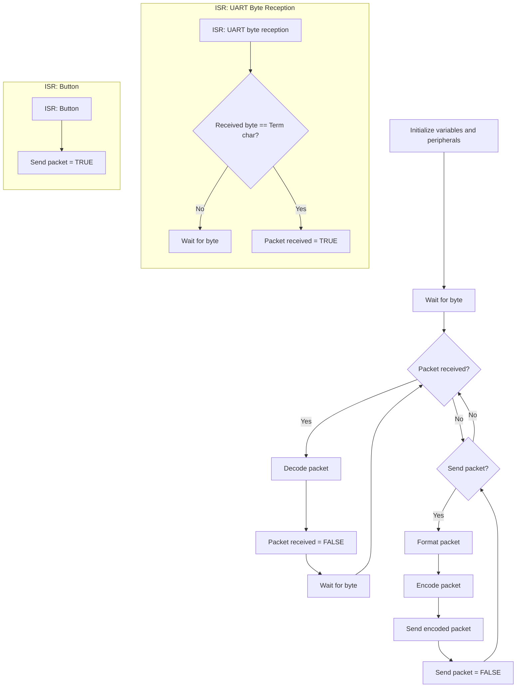

# Serial Communication - Part II

</br>

Here we are in the second part. As always, now **we'll do in STM32Cube what we did in Arduino** in the first part. In this case, **the COBS (de)coding functions have no dependencies** (they don't use Arduino-specific libraries or STM32F4 HAL). Therefore, the functions are directly compatible between Arduino and STM32Cube and **the migration is straightforward**. Since we've already seen how to implement the COBS (de)coding functions, **we'll implement these functions along with UART communication**. This way, we'll be closer to having what we'll need to implement in the project. We'll only need to implement an instruction set, but what that is and how to do it we'll see in the next practice.

This practice will be done **individually** and we'll divide it into **three parts**. In the first part, we'll prepare the project and **migrate the COBS (de)coding functions** that we implemented in the first part of the practice. The second part will consist of **sending a COBS-encoded packet** through UART each time we press the button and see what was sent using CoolTerm. In this second part, we'll take the opportunity to talk about **_endianness_** and **how to send multi-byte data**. The third and final part will consist of **receiving a data packet** from CoolTerm and decoding it.

Let's begin! 💪🏻

## Objectives

- Sending COBS-encoded data packets.
- Receiving COBS-encoded data packets.
- Send multi-byte values byte per byte.
- Distinguishing/identifying _endianness_.

## Procedure

Our final application will follow the flow diagram below. Basically, each time the button is pressed, a packet of bytes will be encoded in COBS (in this case, a decimal value stored in a `float` variable) and, at the same time, we'll also be waiting for the reception of COBS-encoded byte packets and decode them. Let's start by preparing the project.



### Base Project Preparation

#### Project Creation and Configuration

From the `main` branch, create a branch called `stm32cube/<username>/serial-cobs`. Once on that branch, create an STM32Cube project named `serial-cobs` (remember this is an individual project, so create it inside a folder named after your GitHub username within the workspace folder). Once created, as always, create the `setup`/`loop` code structure.

In that new project, **we'll leave the default peripheral configuration** and only **enable interrupts** for the **button** and **UART2**.

#### Migration of (de)coding Functions

Let's **create the `components` folders** in the `Core > Inc` and `Core > Src` folders.

In the `Core > Src` folder, **create the `cobs.c` file**. In that file, **add the functions we developed in the first part**:

```c
#include "cobs.h"

size_t COBS_encode(
    const uint8_t *decodedMessage, // pointer to the buffer where the data to encode is
    size_t length,                 // number of elements in the message to encode
    uint8_t *codedMessage          // pointer to the buffer where the encoded data will be stored
)
{
    size_t read_index = 0,
           write_index = 1,
           code_index = 0;

    uint8_t code = 0x01;
    bool overflow_block = false;

    while (read_index < length)
    {

        if (decodedMessage[read_index] == 0x00)
        {
            codedMessage[code_index] = code;
            code_index = write_index;
            write_index++;
            code = 0x01;
            overflow_block = false;
        }
        else
        {
            codedMessage[write_index] = decodedMessage[read_index];
            write_index++;
            code++;

            if (code == 0xFF)
            {

                codedMessage[code_index] = code;
                code_index = write_index;
                write_index++;
                code = 0x01;
                overflow_block = true;
            }
        }

        read_index++;
    }

    if (overflow_block && code == 0x01)
    {
        return code_index;
    }

    codedMessage[code_index] = code;

    return write_index;
}

size_t COBS_decode(
    const uint8_t *codedMessage, // pointer to the buffer where the data to decode is
    size_t length,               // number of elements in the message to decode
    uint8_t *decodedMessage      // pointer to the buffer where the decoded data will be stored
)
{
    size_t read_index = 0,
           write_index = 0;

    while (read_index < length)
    {

        uint8_t code = codedMessage[read_index];
        read_index++;

        for (size_t i = 1; i < code; i++)
        {
            decodedMessage[write_index] = codedMessage[read_index];
            write_index++;
            read_index++;
        }

        if (code < 0xFF && read_index < length)
        {
            decodedMessage[write_index] = 0x00;
            write_index++;
        }
    }

    return write_index;
}
```

Now let's **create the `cobs.h` file** in the `Core > Inc` folder. The `cobs.h` file would look like this:

```C
#ifndef COBS_H__
#define COBS_H__

#include <stdint.h>
#include <stddef.h>
#include <stdbool.h>

size_t COBS_encode(
    const uint8_t *decodedMessage, // pointer to the buffer where the data to encode is
    size_t length,                 // number of elements in the message to encode
    uint8_t *codedMessage          // pointer to the buffer where the encoded data will be stored
);

size_t COBS_decode(
    const uint8_t *codedMessage, // pointer to the buffer where the data to decode is
    size_t length,               // number of elements in the message to decode
    uint8_t *decodedMessage      // pointer to the buffer where the decoded data will be stored
);

#endif /* COBS_H__ */
```

> [!IMPORTANT]
> I am, let's say, 100% sure you've already noticed this, but I'm mentioning it out of obligation. In the `cobs.h` file we changed the included headers. Previously we had:
>
> ```c++
> #include <cstdint>
> #include <cstddef>
> #include <cstdbool>
> ```
>
> These headers are for C++, but in STM32Cube we program in C, so the headers to use are:
>
> ```c
> #include <stdint.h>
> #include <stddef.h>
> #include <stdbool.h>
> ```

With this, we've already migrated our functions from Arduino to STM32Cube.

### Sending a COBS-encoded Byte Packet

In this part, we'll make it so that each time we press the button, a decimal numerical value stored in a `float` is sent via UART after being encoded in COBS.

#### Bit shifting

We cannot directly send a `float` over the serial port. Why? Let me ask you a question: in byte packets, only bytes can be sent (obvious), how do you send a variable that takes up four bytes?

<picture>
  <source media="(prefers-color-scheme: dark)" srcset="/.github/images/ieee754_to_bytes_map_dark.svg">
  <source media="(prefers-color-scheme: light)" srcset="/.github/images/ieee754_to_bytes_map_light.svg">
  
</picture>

Easy, one by one 😎 The thing is how to convert a `float` of four bytes into an array of four bytes. There are several ways to do this, but the easiest and safest is through bit shifting.

Bit shifting — surprise! — means moving all the bits one position to the left or to the right. We do this with the `>>` or `<<` operators. The first one moves the bits to the right and the second one moves them to the left. The number of positions to shift is indicated right after the operator. For example, if we have `uint8_t x = 16`, its binary representation is `0b00010000`.

> [!NOTE]
> To annotate numbers in binary, we put `0b` in front of them, just as we put `0x` in front of hexadecimal numbers.

If we want to shift the bits of `x` 1 position to the right, we would do:

```c
uint8_t x = 16;

x = x >> 1;
```

Now, `x` in binary is `0b00001000`, which in decimal is 8.

> [!NOTE]
> This is not what we want to focus on right now, but notice how shifting a bit to the right is equivalent to dividing by 2 (16 / 2 = 8). Shifting to the left would be multiplying by 2. For each position shifted we divide/multiply by 2. This is the efficient way the CPU performs these calculations. But that was a side note for our digital general knowledge. Back to the matter at hand.

We can move bits left and right. Fascinating. What do we want this for?... What for?.... WHAT FOR!? I'll get you...

We now have a way to obtain one of the 4 bytes that form the float. Suppose we have `float pi = 3.141592`. In binary this is `0b01000000_01001001_00001111_11011011` (I've used underscores to separate the bytes to make them easier to identify, but this notation is informal). If we want to obtain the most significant byte (MSB), i.e. byte 3, i.e. bits 31 to 24, we must shift all bits to the right by 24 positions until they are in byte 0 (LSB). We would be doing:

<picture>
  <source media="(prefers-color-scheme: dark)" srcset="/.github/images/byte_extraction_dark.svg">
  <source media="(prefers-color-scheme: light)" srcset="/.github/images/byte_extraction_light.svg">
  
</picture>

And once we have it aligned, we can send it over UART. We would do the same for bytes 2, 1, and 0, which would involve shifts of 16, 8, and 0, respectively.

#### Bit masking

A sharp-eyed student 🧐 would notice that the diagram has a step labelled "mask". Well spotted. This is because when shifting bits left or right, the bits that come in are usually 0, but this is undefined in the C language specification and does not always happen — it varies depending on the variable type. Therefore, we cannot guarantee that the new bits are 0. What we do is apply a mask. Basically, once the bits have been shifted, we AND them with `0xFF`, or `0b11111111`. The AND operation is a Boolean multiplication, but it is very similar to the multiplication we know. If I multiply something by 1, I get that something. If I multiply something by 0, I get 0. When we AND by `0xFF`, it is the same as ANDing by `0x000000FF`. The number of leading zeros only depends on the number of bits in the variable we are operating on — in this case, a float has 4 bytes, so 6 zeros appear. The operation takes place bit by bit: bit 0 of one variable is ANDed with bit 0 of the other variable, and so on for all remaining bits. Following the previous example, if we have `0b01000000_01001001_00001111_11011011` and AND it with `0b00000000_00000000_00000000_11111111` (`0x000000FF`), we get `0b00000000_00000000_00000000_11011011`. That is, everything is set to zero except the last byte, which is preserved as-is.

<picture>
  <source media="(prefers-color-scheme: dark)" srcset="/.github/images/mask_operation_dark.svg">
  <source media="(prefers-color-scheme: light)" srcset="/.github/images/mask_operation_light.svg">
  
</picture>

#### Get float bytes as uint32_t bytes

There is one small but important detail left. Bit shifts can only be applied to a specific type of variable: integers. Furthermore, depending on the integer size used, shifting bits involves an implicit cast to a signed `int`, which can lead to undefined or undesired behaviour. The takeaway: before bit shifting, you must obtain the bits to shift as a `uint32_t`. How do we do this? Following the same example, we would need to copy the bytes of the `float` into the bytes of a `uint32_t`. We do this with the `memcpy` function.

```c
#include <string.h>

uint32_t pi_raw;
float pi = 3.141592;

memcpy(&pi_raw, &pi, sizeof(pi_raw));
```

First, notice how we had to include the `string.h` library, which provides the `memcpy` function. Then we simply pass that function: 1) the pointer (memory location) where we want to copy the bytes to, 2) the pointer (memory location) from where we want to copy the bytes, and 3) the number of bytes to copy — in this case limited to the size (obtained via `sizeof`) of the destination variable `pi_raw` (this ensures we do not copy more bytes than `pi_raw` can hold, avoiding a segmentation fault).


> [!NOTE]
> You were happy with Python and you didn't know it...

As a summary so far. If we wanted to send the bytes that make up `float pi = 3.141592`, we would do (using a made-up UART send function):

```c
#include <string.h>

uint32_t pi_raw;
uint8_t pi_bytes[4];
float pi = 3.141592;

memcpy(&pi_raw, &pi, sizeof(pi_raw));

pi_bytes[3] = (pi_raw >> 24) & 0xFF;
pi_bytes[2] = (pi_raw >> 16) & 0xFF;
pi_bytes[1] = (pi_raw >> 8) & 0xFF;
pi_bytes[0] = pi_raw & 0xFF;

uart_send(pi_bytes[0]);
uart_send(pi_bytes[1]);
uart_send(pi_bytes[2]);
uart_send(pi_bytes[3]);
```

And here we could stop (but we won't, obviously). One thing we still need to see/understand is: is byte 0 the [MSB (_Most Significant Byte_)](https://en.wikipedia.org/wiki/Most_significant_byte) or the [LSB (_Least Significant Byte_)](https://en.wikipedia.org/wiki/Least_significant_byte)? It's important to know this to later follow the convention we establish in serial communication. That convention will set whether we send the MSBs or LSBs first. We're talking about _endianness_.

#### _Endianness_

**_Endianness_ is nothing more than the order in which the bytes of a variable are stored in memory**. In _little endian_, the least significant byte of a variable is stored in the memory space with the smallest memory address. _Big endian_, just the opposite. The most significant byte is stored in the memory position with the smallest memory address. If it's not clear to you, you can find more information [here](https://en.wikipedia.org/wiki/Endianness#Mapping_multi-byte_binary_values_to_memory).

In our case, we can check in the [reference manual](https://www.st.com/resource/en/reference_manual/dm00096844-stm32f401xbc-and-stm32f401xde-advanced-armbased-32bit-mcus-stmicroelectronics.pdf) of our microcontroller (page 38) that our microcontroller stores data in _little endian_ format.

This is in terms of how the variable is stored in memory, but then there is also the convention (which we decide ourselves) in which we send the bytes of the float. If we send the LSB first, we are sending in little endian. If we send the MSB first, we are sending in big endian. Same concept, different usage scenarios.

#### Sending a _float_

Now we know how to do a conversion from _floats_ to _arrays_. We also know how to operate with our microcontroller's UART with the HAL to send a data packet. Our GPIO interrupts: controlled. And we've migrated the COBS functions to encode a packet before sending it. We have everything.

> [!NOTE]
> There are other methods to convert a `float` variable to a byte array, but we have seen the most conservative, portable, and safe of all of them. Other methods may work on a controlled platform or target, but they have what is known in C as undefined behaviour and you can only be sure they work when you test them. The method we have seen works always and on any platform.

First, let's create the _callback_ for the button interrupts. When pressed, it will toggle the value of a flag variable called `send_data`.

> [!NOTE]
> A flag variable serves to store a state. In this case, we'll use a flag to store the "button pressed" event.

We'll also create two _buffers_/_arrays_. One to store the message we want to send and another to store that message encoded in COBS and which will be what we finally send. The code of our `app.c` file would look like this (you have the implementation details in the code itself):

```c
#include "cobs.h"
#include "main.h"
#include <stdbool.h>
#include <string.h>

#define UART_TERM_CHAR 0x00  // Character used to indicate the end of a packet.
#define UART_BUFFER_SIZE 128 // Size of the UART transmission buffer.

extern UART_HandleTypeDef huart2;

bool send_data = false; // Flag that indicates we want to send a packet.

uint8_t tx_buffer[UART_BUFFER_SIZE] = {0}; // UART transmission buffer.
uint8_t tx_decoded[UART_BUFFER_SIZE] = {0}; // Buffer with the decoded packet to transmit.

uint32_t tx_encoded_length = 0; // Size of the encoded buffer to transmit.

void setup(void) {}

// Function executed in the while loop.
void loop(void) {

  // If we want to send a packet...
  if (send_data) {

    // Example float to char/byte array:
    // float = 4 bytes ( BYTE3 | BYTE2 | BYTE1 |BYTE0 )
    float decimal_number = 34.52;
    uint32_t decimal_number_raw;

    memcpy(&decimal_number_raw, &decimal_number,
            sizeof(decimal_number_raw)); // Copy the bytes of the float into an
                                         // uint32_t variable.

    // We decide to send it little endian, so we save the bytes in the order of
    // BYTE0, BYTE1, BYTE2, BYTE3.
    tx_decoded[0] = decimal_number_raw & 0xFF;         // BYTE0
    tx_decoded[1] = (decimal_number_raw >> 8) & 0xFF;  // BYTE1
    tx_decoded[2] = (decimal_number_raw >> 16) & 0xFF; // BYTE2
    tx_decoded[3] = (decimal_number_raw >> 24) & 0xFF; // BYTE3

    tx_encoded_length = COBS_encode(
        tx_decoded, 4, tx_buffer); // We encode the packet to send. We save the
                                   // size of the resulting buffer.
    tx_buffer[tx_encoded_length] = UART_TERM_CHAR; // We add the term char
    tx_encoded_length++; // Array indices start at 0. We increment by 1 to get
                         // the length.
    HAL_UART_Transmit_IT(&huart2, tx_buffer, tx_encoded_length); // We send

    send_data = false; // We deactivate the flag.
  }
}

// ISR for the button.
void HAL_GPIO_EXTI_Callback(uint16_t GPIO_Pin) {
  send_data = true; // We activate the flag to send a packet.
}
```

There are a couple of _defines_/macros. These macros are `UART_BUFFER_SIZE` and `UART_TERM_CHAR`. The first one I've defined as 128 and the second one as `0x00`.

We compile and debug. We open CoolTerm, if we didn't have it open already, and configure the connection at 115200 8N1 and connect. We press the microcontroller's button and check that we receive the expected data. How can you check it? Use _breakpoints_ and check that the steps are performed correctly by seeing the values that the _buffer_ takes before and after encoding.

> [!TIP]
> If we send that 34.52 encoded in COBS, in CoolTerm we should receive `0x05 0x7B 0x14 0x0A 0x42 0x00`.

### Receiving COBS-encoded Byte Packets

Now we'll prepare our microcontroller to receive COBS-encoded byte packets. Once received, we'll decode them. We'll use, once again, a flag variable called `data_received`. We'll activate that flag when we receive a _term char_. This case is much simpler than the previous one and we'll comment the operation directly in the code. I'll only leave the comments of what we've added:

```c
#include "cobs.h"
#include "main.h"
#include <stdbool.h>
#include <string.h>

#define UART_TERM_CHAR 0x00
#define UART_BUFFER_SIZE 128

extern UART_HandleTypeDef huart2;

bool send_data = false;
bool data_received = false; // Flag that indicates we've received a packet.

uint8_t rx_buffer[UART_BUFFER_SIZE] = {0}; // UART reception buffer.
uint8_t rx_decoded[UART_BUFFER_SIZE] = {0}; // Buffer with the received decoded packet.

uint32_t rx_decoded_length = 0; // Size of the decoded received buffer.

uint8_t tx_buffer[UART_BUFFER_SIZE] = {0};
uint8_t tx_decoded[UART_BUFFER_SIZE] = {0};

uint32_t tx_encoded_length = 0;
uint32_t rx_index = 0;          // Index of the UART reception buffer.

void setup(void) {
  HAL_UART_Receive_IT(&huart2, &rx_buffer[rx_index],
                      1);  // We wait for the reception of the first byte.
  (void)rx_decoded_length; // "Trick" to make the compiler not eliminate this
                           // variable since we never use it. Remember from
                           // previous practices.
}

// Function executed in the while loop.
void loop(void) {

  // If we've received a packet...
  if (data_received) {

    rx_decoded_length =
        COBS_decode(rx_buffer, rx_index, rx_decoded); // We decode the packet.

    // Here we would put everything the microcontroller should do based on the
    // received packet: obey orders, configure variables, etc.
    // In this practice we don't do anything.

    rx_index = 0; // We reset pointer.

    data_received = false; // We deactivate the flag.
    HAL_UART_Receive_IT(&huart2, &rx_buffer[rx_index],
                        1); // We reactivate reception.
  }

  if (send_data) {

    float decimal_number = 34.52;
    uint32_t decimal_number_raw;

    memcpy(&decimal_number_raw, &decimal_number,
           sizeof(decimal_number_raw));

    tx_decoded[0] = decimal_number_raw & 0xFF;
    tx_decoded[1] = (decimal_number_raw >> 8) & 0xFF;
    tx_decoded[2] = (decimal_number_raw >> 16) & 0xFF;
    tx_decoded[3] = (decimal_number_raw >> 24) & 0xFF;

    tx_encoded_length = COBS_encode(
        tx_decoded, 4, tx_buffer);
    tx_buffer[tx_encoded_length] = UART_TERM_CHAR;
    tx_encoded_length++;
    HAL_UART_Transmit_IT(&huart2, tx_buffer, tx_encoded_length);

    send_data = false;
  }
}

void HAL_GPIO_EXTI_Callback(uint16_t GPIO_Pin) {
  send_data = true;
}

// ISR for receiving 1 byte via UART.
void HAL_UART_RxCpltCallback(UART_HandleTypeDef *huart) {

  if (rx_buffer[rx_index] ==
      UART_TERM_CHAR) { // If we've received the term char...
    data_received =
        true; // We activate the flag that indicates the reception of a packet.
  } else {    // If not...
    rx_index++; // We increment the reception buffer index...
    HAL_UART_Receive_IT(&huart2, &rx_buffer[rx_index],
                        1); // and we wait to receive one more byte.

    // Here we should check that the reception buffer doesn't overflow,
    // but we skip it for simplicity.
  }
}
```

We compile and start the program in the microcontroller. We go to CoolTerm and send in hexadecimal a COBS-encoded message (so it can't have random bytes or contain `0x00`) and add the final _term char_ `0x00`. Use _breakpoints_ to see what has been received in the microcontroller and the decoded message.

> [!TIP]
> If we send `0x05 0xF4 0xFD 0xA4 0x40 0x00` in COBS from CoolTerm, we should receive (once decoded) `0xF4 0xFD 0xA4 0x40`, which is equivalent to 5.156.

With this last case, we've already implemented the flow diagram from the beginning of the guide 😎

### Pull Request and Tests

I can verify that you are sending correctly in COBS without any problem. I automate the button press and receive the COBS packet you have prepared when `send_data` is `true`. However, right now there is no way to tell whether you have correctly received a COBS packet that I send you over serial, or whether you have been able to decode it correctly. For this reason, once you decode the packet, send it as-is over the serial port so I can run the tests.

```diff
...

  if (data_received) {

    rx_decoded_length =
        COBS_decode(rx_buffer, rx_index, rx_decoded); // We decode the packet.

    // Here we would put everything the microcontroller should do based on the
    // received packet: obey orders, configure variables, etc.
    // In this practice we don't do anything.

    rx_index = 0; // We reset pointer.

+	HAL_UART_Transmit_IT(&huart2, rx_decoded, rx_decoded_length);

    data_received = false; // We deactivate the flag.
    HAL_UART_Receive_IT(&huart2, &rx_buffer[rx_index],
                        1); // We reactivate reception.
  }
  ...
```

Once you have done this, you can open your Pull Request to the `main` branch. Wait for the test results. If there are any issues, fix them, and once all tests pass, merge the Pull Request.

## Challenge

No challenge 🙅‍♂️

## Evaluation

### Deliverables

These are the elements that should be available to the teacher for your evaluation:

- [ ] **Commits**
      Your remote GitHub repository must contain at least the following required commits: serial-cobs.

- [ ] **Pull Requests**
      The different Pull Requests requested throughout the practice must also be present in your repository.

- [ ] ~~**Challenge**~~

## Conclusions

In this practice, we've implemented **COBS encoding along** with **sending** and **receiving** byte packets with UART. For this, we've seen what **bit shifting** and **masks** are and how to use them for _float_ to _array_ conversions. We've also seen what _endianness_ is and how it affects data storage in memory or communication conventions.

In the **next practice**, we'll finally finish the UART communication. **We'll implement an instruction set**. We'll see what that is 😉
